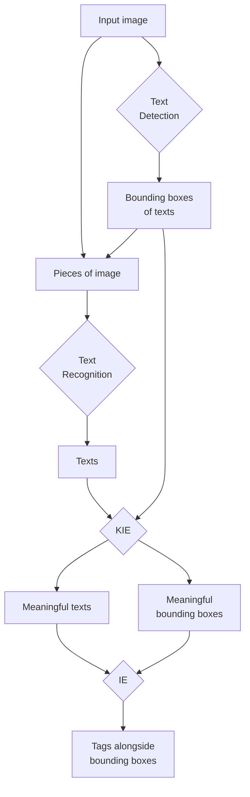

# Vietnamese Scene Text Application

***Please carefully read this README before running any code.***

**This project is still under construction.**

## Requirements

Python version is 3.10.16.

PyTorch 2.4.1 is required. Follow [this instruction](https://pytorch.org/get-started/previous-versions/#v241) to install it.

Other required packages are listed in the [`requirements.txt`](./requirements.txt).

Make sure you have these files downloaded:

| Download URL | Save to path |
| ------------ | ------------ |
| [Google Drive](https://drive.google.com/file/d/1Jk4eGD7crsqCCg9C9VjCLkMN3ze8kutZ/view) | weights/craft_mlt_25k.pth |
| [Google Drive](https://drive.google.com/file/d/1XSaFwBkOaFOdtk4Ane3DFyJGPRw6v5bO/view) | weights/craft_refiner_CTW1500.pth |
<!-- | [MC-OCR Competition 2021](https://aihub.ml/competitions/1) | data/mc_ocr_warmup_500images.zip | -->
<!-- | [MC-OCR Competition 2021](https://aihub.ml/competitions/1) | data/mcocr2021_public_train_test_data.zip | -->

## Files

Streamlit app:

```bash
streamlit run app.py
```

API:

```bash
fastapi run api.py
```

Scripts:

- [PARSeq inference](./parseq.py)
- [VietOCR inference](./vietocr_api.py)
- [CRAFT + VietOCR inference](./scene_text.py)

Experimental notebooks:

- [VietOCR: Inference example](./01_vietocr_example.ipynb)
- [PARSeq: Inference example](./02_parseq_example.ipynb)
- [CRAFT + VietOCR/PARSeq: Inference example](./03_craft_vietocr_parseq_example.ipynb)

## What is going on?


