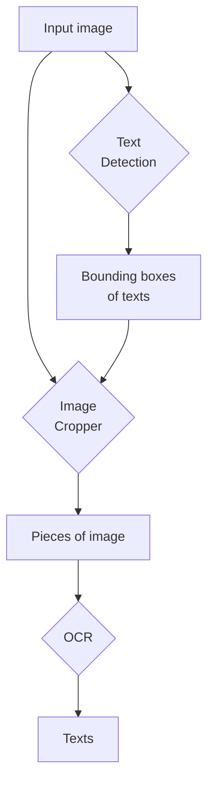

# Vietnamese Scene Text Application

***Please carefully read this README before doing anything. Thanks.***

**This project is still under construction.**

## Requirements

Before running any code, make sure you have these files downloaded:

| Download URL | Save to path |
| ------------ | ------------ |
| [Google Drive](https://drive.google.com/file/d/1Jk4eGD7crsqCCg9C9VjCLkMN3ze8kutZ/view) | weights/craft_mlt_25k.pth |
| [Google Drive](https://drive.google.com/file/d/1XSaFwBkOaFOdtk4Ane3DFyJGPRw6v5bO/view) | weights/craft_refiner_CTW1500.pth |
| [MC-OCR Competition 2021](https://aihub.ml/competitions/1) | data/mc_ocr_warmup_500images.zip |
| [MC-OCR Competition 2021](https://aihub.ml/competitions/1) | data/mcocr2021_public_train_test_data.zip |

I used Python 3.10.11 and installed the packages as described in the `requirements.txt` file. Any other version of Python or the packages are untested.

## Files

Streamlit app: (run with `streamlit run app.py`)

- [app.py](./app.py)

Scripts:

- [PARSeq inference](./parseq.py)
- [VietOCR inference](./vietocr_api.py)
- [CRAFT + VietOCR inference](./scene_text.py)

Experiment notebooks:

- [PARSeq: Inference example](./parseq_example.ipynb)
- [VietOCR: Inference example](./vietocr_example.ipynb)
- [CRAFT + VietOCR/PARSeq: Inference example](./craft_vietocr_parseq_example.ipynb)

## What is going on?

