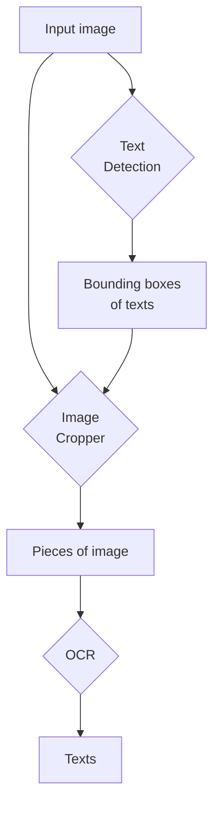

# Vietnamese Scene Text Application

**This project is under construction.**

***Please carefully read this README before doing anything. Thanks.***

I used Python 3.10.11 and installed the packages as described in the
`requirements.txt` file. Any other version of Python or the packages
are untested.

Scripts:

- [CRAFT + VietOCR inference](./scene_text.py)

Experiment notebooks:

- [VietOCR: Inference example](./vietocr_example.ipynb)
- [CRAFT + VietOCR: Inference example](./text_detection_example.ipynb)

Before running any code, make sure you have these files downloaded:

| Download URL | Save to path |
| ------------ | ------------ |
| [Google Drive](https://drive.google.com/file/d/1Jk4eGD7crsqCCg9C9VjCLkMN3ze8kutZ/view) | weights/craft_mlt_25k.pth |
| [Google Drive](https://drive.google.com/file/d/1XSaFwBkOaFOdtk4Ane3DFyJGPRw6v5bO/view) | weights/craft_refiner_CTW1500.pth |

## What is going on?

